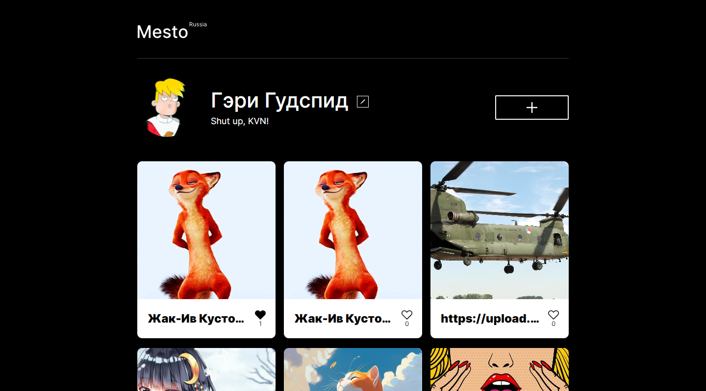

# Проект: Место (React, с авторизацией и регистрацией)

Учебный проект выполненный в рамках курса "Веб-разработчик" от Яндекс Практикум. Проект представляет из себя фото-блог с возможностью добавления карточек интересных мест.

## Оглавление

- [Обзор проекта](#обзор-проекта)
  - [Задачи проекта](#задачи-проекта)
  - [Функциональность проекта](#функциональность-проекта)
  - [Screenshot](#screenshot)
  - [Директории проекта](#директории-проекта)
  - [Запуск проекта](#запуск-проекта)
  - [Ссылки](#ссылки)
- [Ход выполнения проекта](#ход-выполнения-проекта)
  - [Используемые технологии](#используемые-технологии)
  - [Чему я научился работая над проектом](#чему-я-научился-работая-над-проектом)
- [Автор](#автор)

## Обзор проекта

### Задачи проекта

Проект был призван изучить основы фреймворка React, разработки SPA, и работе с React Router.

### Функциональность проекта

Продолжение работы над проектом Место. Проект сохранил всю свою исходную функциональность, с которой можно ознакомиться [здесь](https://github.com/Bjorn86/mesto-react). В проект добавлена возможность регистрации и аутентификации пользователя, созданы соответствующие роуты для этих операций. Произведена интеграция с ещё одним REST API для регистрации и аутентификации пользователей.

### Screenshot

### Директории проекта

- `src/blocks` — директория с CSS файлами
- `src/components` — директория с компонентами
- `src/contexts` — директория с элементами контекста
- `src/fonts` — директория со шрифтами
- `src/images` — директория с файлами изображений
- `src/utils` — директория со вспомогательными файлами
- `src/vendor` — директория с файлами библиотек

### Запуск проекта

- `npm run build` — запуск проекта в режиме продакшн, с формированием файлов подготовленных к деплою в директории `/build`
- `npm start` — запуск проекта в режиме разработки

### Ссылки

- [Ссылка на репозиторий проекта](https://github.com/Bjorn86/react-mesto-auth)
- [Ссылка на демо-страницу проекта](https://bjorn86.github.io/react-mesto-auth/)
- [Ссылка на ветку собранного проекта](https://github.com/Bjorn86/react-mesto-auth/tree/gh-pages)

## Ход выполнения проекта

### Используемые технологии

- HTML
- CSS
- JS
- [React](https://react.dev/)
- [React Router](https://reactrouter.com/en/main)
- [Create React App](https://create-react-app.dev/)
- Адаптивная вёрстка
- Семантическая вёрстка

### Чему я научился работая над проектом

- Работе с JWT-токеном
- Работе с React Router

## Автор

**Данила Легкобытов**

- e-mail: [legkobytov-danila@yandex.ru](mailto:legkobytov-danila@yandex.ru)
- Telegram: [@danila_legkobytov](https://t.me/danila_legkobytov)
